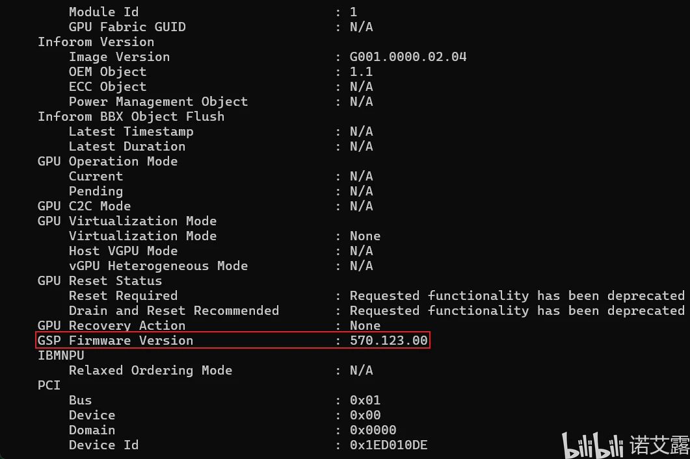

## 前言

**前言:**明明我的电脑性能足够,玩游戏的时候也远远没达到温度墙,按理来说不会突然的降频，导致游戏卡顿.但是玩FPS游戏高速转动视角和跟别人打架开镜的时候很容易出现突发性卡顿，然后瞬间恢复,试了各种方法都没有试好,最后终于在一篇教程里面打开了英伟达的**gsp固件**功能最后将**low帧**稳住

---

## 教程

**教程:**

1. cmd+r运行**regedit**，打开注册表,
2. 在`HKEY_LOCAL_MACHINE\SYSTEM\CurrentControlSet\Control\Class\{4d36e968-e325-11ce-bfc1-08002be10318}`里面有**一个或几个文件夹**（核显或者独显），
3. 我们找到文件夹下面有**英伟达标识字样的值**的**文件夹**，在**对应文件夹**下面新建**DWORD**,名称**EnableGpuFirmware**,值为**1**,就可以成功打**gsp**了.
4. 重新启动系统后，如果成功开启**gsp**,可以在PowerShell中输入 “`nvidia-smi -q`” 可显示固件版本.

---

## 原理猜测

**原理猜测:**gsp固件就是相当于给GPU单独开了一个微处理器，把部分工作交给GPU运行而不是CPU.总是遇到这种突发性卡顿问题,所以大概率是电脑CPU的一些东西出现了问题所导致的,当开启**GSP**时将cpu部分工作交给了gpu内的微处理器，所以**low帧**的问题有所缓解