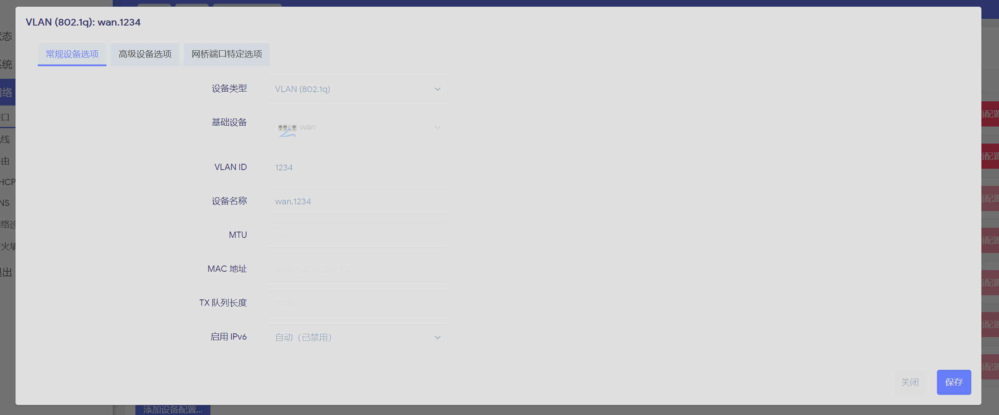
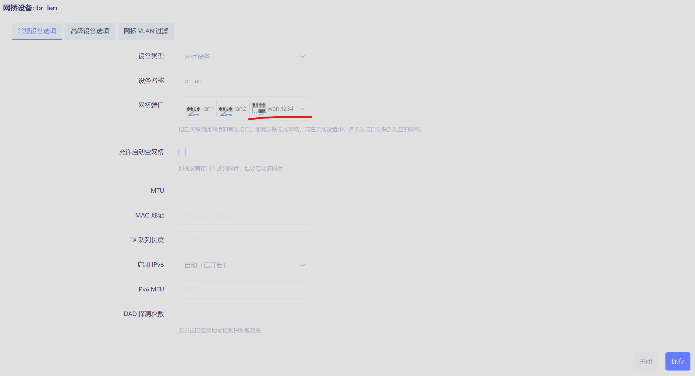
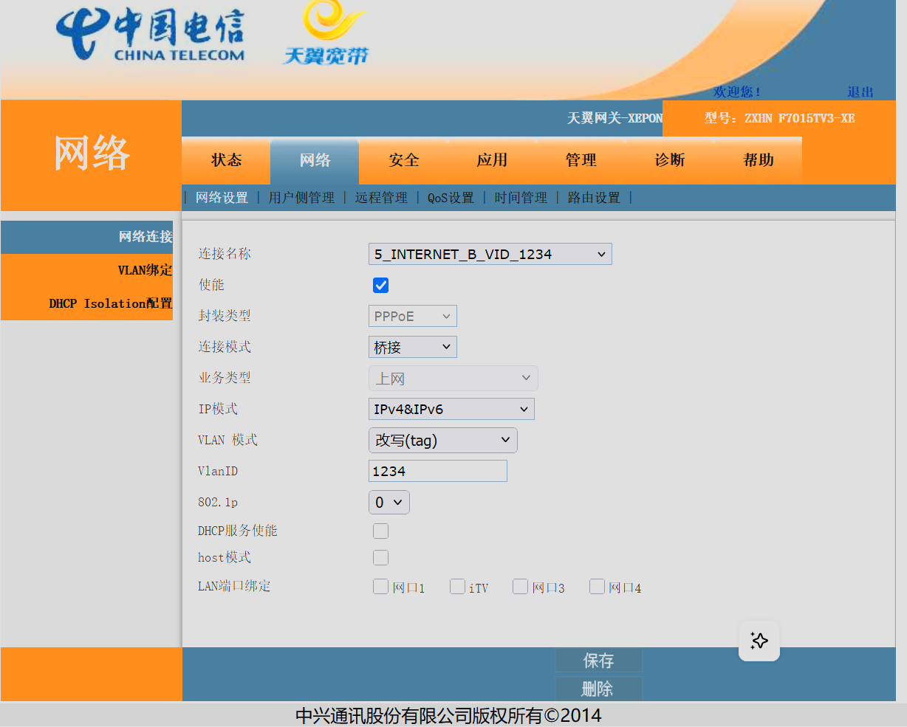
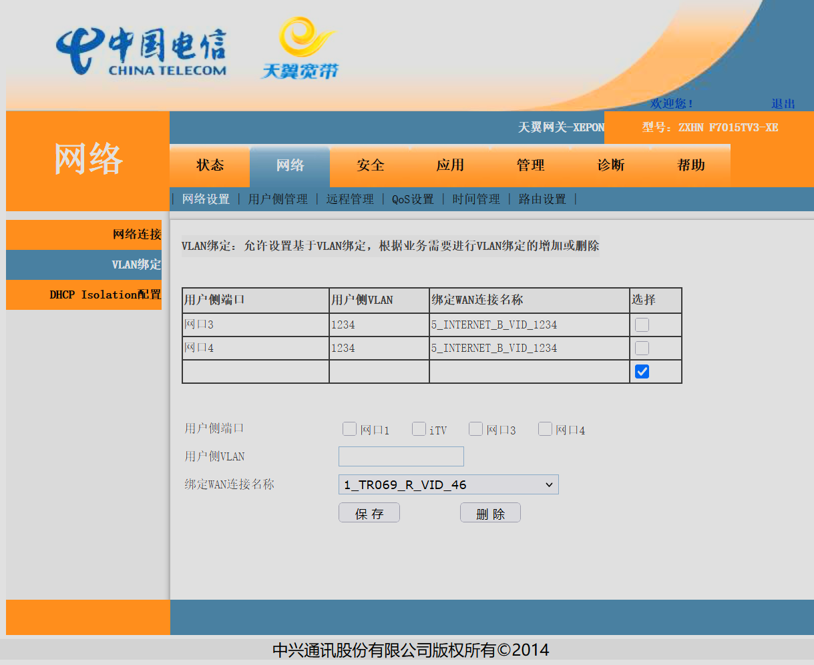
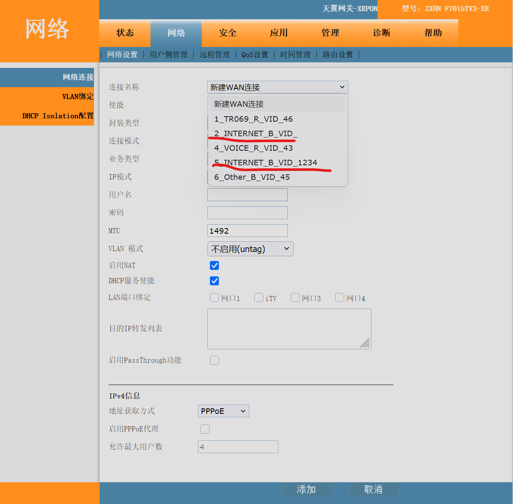
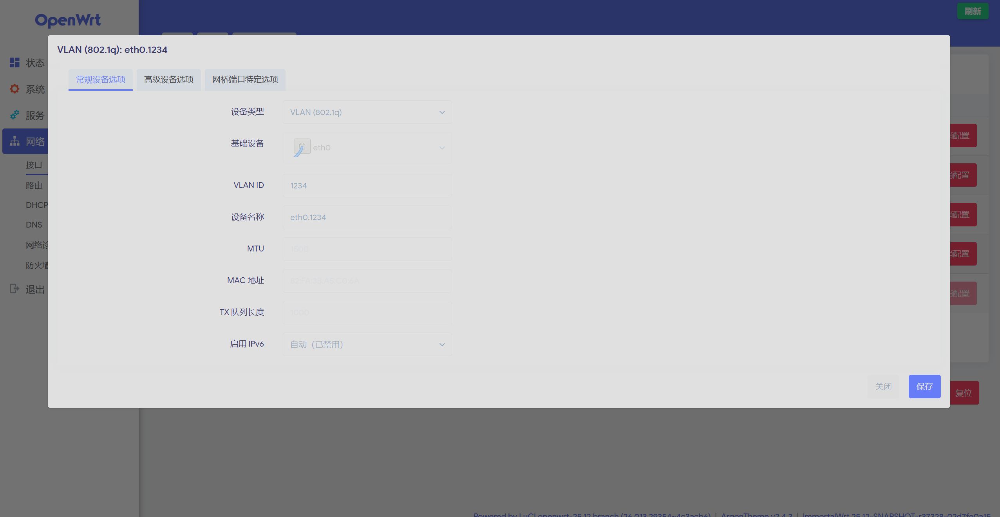
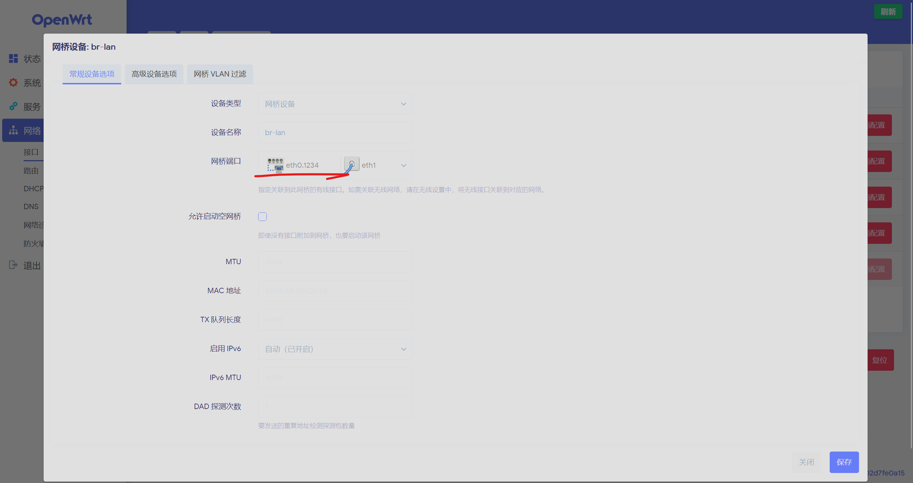

## 原理解析

(特别注意:有一些路由器的系统是不支持设置vlanid的,所以建议所有路由器都为openwrt软路由，方便操作.)

在传统方案中,当光猫设置**桥接模式**,软路由负责拨号,此时光猫的其他网口在正常情况下是无法工作的,因为光猫此时只做光电转换，不做路由ip下发.

此时我们便需要用到一项技术实现光猫在桥接模式下光猫的其他网口也能正常工作.这便是**vlanid**.vlanid并不只有**单线复用**这一个功能,它也可以用来划分局域网,从本质上来讲，它的作用就是给流量打上标记.

当光猫桥接主路由拨号时,其他房间网口的流量是流向光猫的网口,在流量没有打**vlanid**标识的情况下，光猫也不知道要把这些流量弄到哪里去,所以光猫其他网口便无法正常通讯.

所以这个时候我们便用**vlanid**来实现**单线复用**(**即一条网线，负责实现两个功能,也就是说我们主路由与光猫连接的那根网线既负责主路由的拨号，又负责主路由dhcp服务器下发ip到光猫的其他网口**),我们在其他网口的房间里的路由器里面设置**vlanid**,然后在光猫的管理员后台里也设置的**vlanid**,最后在主路由里面设置一样的**vlanid**.就这样在三台设备中都设置了**vlanid**,设备就知道这些流量该如何传输.

## 具体操作

1. 在房间的子路由中把**wan接口删除**,只留lan口,然后在设备中添加连接网线的网口的vlan设备,然后把这个设备添加到**br-lan**的网桥设备集合之中
  
  

2. 在光猫的管理员后台(**不同的型号的光猫进入管理员后台的方法不同，有一些甚至进不去管理员后台，这里就不细讲了**),把对应连接方式的lan口绑定全部取消,然后设置对应网口的**vlanid和vlan绑定**
  
  
  
  以上这张图中，网络连接二是用于主路由和光猫拨号的，而网络连接五则是用于设置vlanid来实现单线复用的。
3. 在主路由进行和子路由中一样的操作,只是这一次不用把wan口删除了,把wan口对应的连接端口设置**vlanid**,然后也一并添加到**br-lan**中即可完成配置
  
  

完成了以上三个步骤,就可以实现光猫在**桥接模式**下，房间的子路由仍然可以接收到主路由下发的ip了