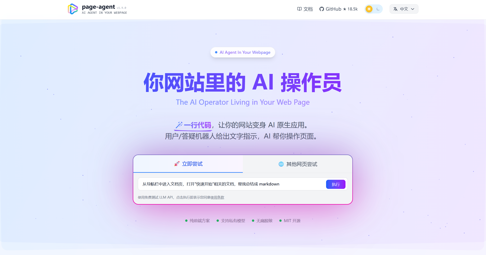

## 前言
有一次在[linux.do](https://linux.do)上逛的时候,发现了一个有趣的项目([page-agent](https://alibaba.github.io/page-agent/docs/introduction/quick-start)),可以用自然语言让ai控制网页，不像传统的自动化网页方案，需要利用Python使用有头或者无头浏览器之类的。这个项目直接是作为js脚本，直接可以嵌入或hook在浏览器中,不需要依赖Python或者其他的东西,更简单易用，好上手。

## 思考
不过很可惜，原项目是完全基于网页dom文本化的操作方案，网页上的图片信息并不会输出在给ai的文本信息里面，也就是说无法识别网页图片，并且在在网页的文字识别上也加了很多限制，有时候有一些网站的有效信息无法被正常识别。于是乎我想研究一下，看一下能不能在原项目的基础上，让它支持识别图片，并且可以识别更多的网页文字。在经过几天的努力，也是终于把这两个问题给搞定了。

## 改进方法

### 一、让 AI 识别图片：将图片链接注入 DOM 树

原项目在生成 DOM 树字符串时，默认的属性白名单 `r` 中 **不包含 `src`**，因此 `` 标签的链接不会传递给 AI。此外，图片元素通常不被标记为“可交互”，导致其属性在 `F()` 函数中根本不会被提取。

**修改步骤**：

1. **将 `src` 加入属性白名单**  
   在 `flatTreeToString` 函数的开头，`r` 数组中添加 `'src'`，这样 `src` 属性就会在 `matchAttributes` 中被匹配并输出。

2. **在 `dom_tree_default` 的 `F()` 函数中手动提取 `` 的属性**  
   原代码只有满足 `k(e)`（交互元素）或 `iframe`/`body` 的元素才会提取属性。我们在 `F()` 中增加一个分支：当 `e.tagName.toLowerCase() === 'img'` 时，手动将其所有属性复制到 `r.attributes` 对象中。

3. **在 `flatTreeToString` 中为 `` 特殊输出**  
   在 `u()` 函数中，当遇到 `e.tagName === 'img'` 时，直接输出 `` 格式，并附带 `[图片链接: ...]` 标记，便于 AI 识别。为了避免输出 `data:image` 等内嵌图片，用正则过滤掉 Base64 链接。

**效果**：  
AI 收到的 `<browser_state>` 中会出现如 `[图片链接: https://example.com/photo.jpg]` 的信息，AI 知道这是一张图片，可以调用后续的工具来识别。

### 二、突破文字识别限制：移除文本节点的可见性过滤

原项目对文本节点的输出设有多重限制：
- `l(e)` 检查：若文本位于可交互元素内部则跳过。
- `isTopElement` 检查：只有父元素是“顶层元素”（未被遮挡、不在视口外）时才输出。
- `isVisible` 检查：父元素必须可见（`offsetWidth/Height > 0` 且 CSS 未隐藏）。

这些限制导致许多嵌套较深或位置特殊的文本（如 Monaco 编辑器内的代码、被 `overflow: hidden` 包裹的内容）无法被 AI 读取。

**修改步骤**：

1. **移除 `l(e)` 检查**：在 `flatTreeToString` 中删除 `if (l(e)) return;` 这一行。
2. **移除 `isTopElement` 检查**：将文本输出的条件从 `e.parent.isTopElement` 改为直接忽略，只保留 `e.parent.isVisible`（或完全去掉，保留所有可见文本）。
3. **放宽 `x(e)` 函数**：在 `dom_tree_default` 中，将 `x(e)` 改为始终返回 `true`，让所有文本节点都被视为可见，不会被丢弃。
4. **可选：移除 `C(e)` 中的尺寸检查**：如果希望进一步解除限制，可将 `C(e)` 中的 `offsetWidth > 0 && offsetHeight > 0` 条件改为始终 `true`，但这会导致大量不可见元素被纳入，建议谨慎。

**效果**：  
现在几乎所有可见的文本节点都会被输出，包括代码编辑器内部的代码、被遮挡的说明文字、侧边栏小字等。AI 的上下文信息量显著增加，但同时 token 消耗也会上升，可根据实际场景调整。

### 三、让 AI 自主调用图片识别工具

仅让 AI “看到”图片链接还不够，还需要让它能够**理解图片内容**。我们增加一个自定义工具 `recognize_image`，AI 可以调用它来识别指定 URL 的图片，并将结果写回图片的 `alt` 属性。

**工具定义**（使用 Zod 进行参数校验）：

```javascript
recognize_image: {
  description: '识别指定 URL 的图片内容，将识别结果写入该图片的 alt 属性，并返回描述文本。',
  inputSchema: z.object({
    imageUrl: z.string().url(),
  }),
  execute: async function (input, { signal }) {
    const { imageUrl } = input;
    // 优先尝试直接使用 URL，失败则转换为 Base64
    // 调用视觉 API（如 Qwen-VL、GPT-4V 等）
    const response = await fetch('...', { ... });
    const description = ...; // 从 API 响应中提取描述
    // 查找页面中对应的 img 元素，写入 alt
    const img = document.querySelector(`img[src="${imageUrl}"]`);
    if (img) img.alt = description;
    return `图片识别完成，描述为：“${description}”`;
  }
}
```

## 总结
于是乎，在经过了以上这些操作，成功让原项目支持了图片识别以及解除了一些网页文字识别的限制。以下是我改进版的仓库地址
https://github.com/iliaoke/page-agent


