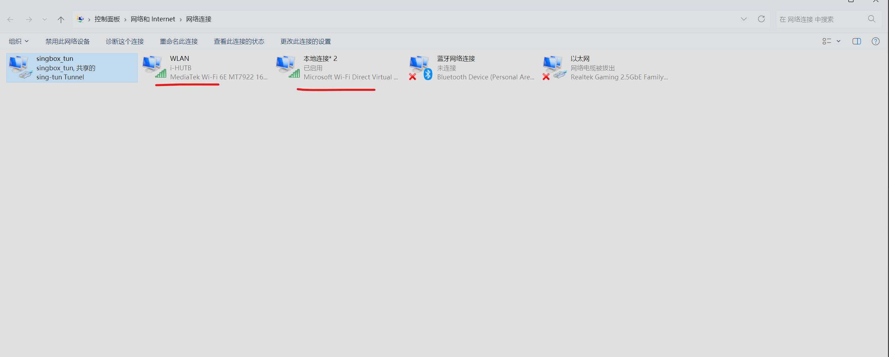
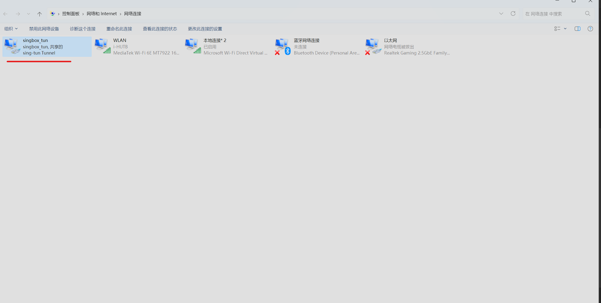
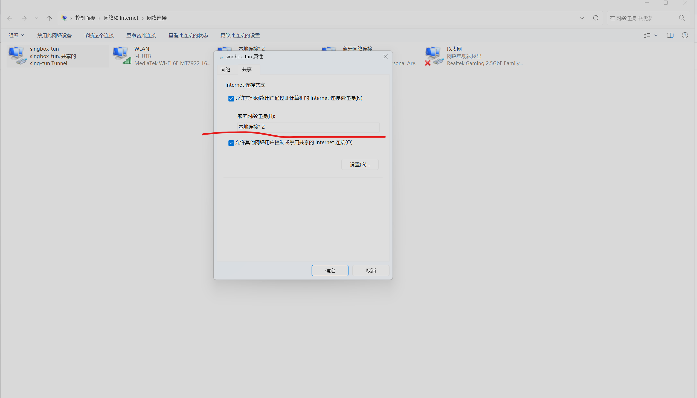

## 前言

前言:弄到了一个白嫖的校园网账号,但是触发设备连接上限了(电脑只要开热点，wifi就无法访问互联网),我手机电脑无法同时连接,于是便有了接下来这篇教程

## 原因解析

原因解析:

1. 当电脑连接WIFI的时候,网络适配器中的wlan网卡便是已连接的状态
2. 此时我们打开热点,在网络适配器中会自动创建一个新的本地连接的网卡
3. 在默认情况下,热点的网卡会自动寻找可以访问互联网的网卡，作为上级网卡.
4. 但是由于校园网有检测,当热点网卡的流量转发到wlan时,校园网就会检测到有多个设备，从而断开访问

## 解决方法

解决方法:

1. 通过手动设置热点网卡的上级网卡到其他的网卡,然后其他网卡的流量(经过这个网卡，对流量进行处理)再流入wlan,这样便不会被校园网检测.
2. 于是我们便要用到clash/singbox这样的代理工具的tun模式创造另外一个网卡(其实也可以用wintun驱动手动创建,不过得手动配置一些东西，比较麻烦)
3. 不一定需要添加clash的代理配置文件,只要打开tun模式即可.
4. 此时网络适配器中将会多出一张其他的网络设备

5. 此时右击该网卡属性点击共享，然后设置共享的网络为本地连接(手动指定热点的上级网络),便可以实现绕过校园网检测

