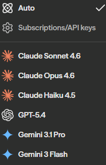
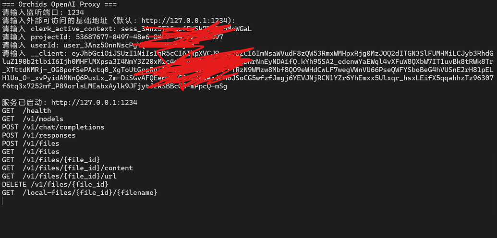

## 前言

最近看到 [Orchids](https://www.orchids.app) 给了免费的 Claude 和 GPT 额度，但它只提供网页端，没有开放后端 API。  
我就做了一个小实验：不去改它服务端，只复用网页端已有调用链路，把能力封装成一个 **OpenAI API 兼容网关**，方便接入各类客户端和工具链。

 

这个方案可以跑通，支持流式、思考模式和文件上传，但并不适合做高并发号池，额度和速率都受原平台会话机制限制。本文主要是技术复盘与工程总结。

---

## 一、协议适配

这次的目标很明确：

1. 复用网页端已有会话与鉴权流程  
2. 把上游 SSE 数据流转换成标准 OpenAI 返回结构  
3. 对外暴露常见 OpenAI 接口，做到低改造接入

最终本地服务提供了这些路由：

- `GET /health`
- `GET /v1/models`
- `POST /v1/chat/completions`
- `POST /v1/responses`
- `POST /v1/files`
- `GET /v1/files`
- `GET /v1/files/{file_id}`
- `GET /v1/files/{file_id}/content`
- `GET /v1/files/{file_id}/url`
- `DELETE /v1/files/{file_id}`

---

## 二、链路分析：从网页请求里抽象最小参数集

在网页端实际请求里，可以定位到这几个关键参数：

- `clerk_active_context`
- `projectId`
- `userId`
- `__client`

其中：

- `projectId` 来自对话创建后的项目上下文
- `clerk_active_context` 与 `__client` 用于会话鉴权
- `userId` 用于拼接上游请求体

这四个参数就是整个中转服务的最小可用配置。程序启动时交互输入，避免硬编码到源码里。

---

## 三、程序架构

### 1) 配置与服务启动

服务启动后读取配置并初始化两个 HTTP Client：

- `jwtClient`：用于向 Clerk 换取 JWT
- `upstreamClient`：用于请求 Orchids 的 `stream-run` SSE 接口

同时挂载 OpenAI 风格路由，作为统一入口。

### 2) 鉴权流程

核心流程是：

1. 调用 Clerk token 接口（带 `__client` Cookie）  
2. 获取临时 JWT  
3. 用 JWT 访问上游推理 SSE

也就是说，本地网关没有伪造新鉴权体系，而是复用了网页端已有会话链路。

### 3) 上游请求与容错

上游请求采用以下策略：

- `Authorization: Bearer <jwt>`
- `Accept: text/event-stream`
- 网络可重试错误自动重试一次
- 失败时返回清晰错误（包含状态码与上游响应）

这块是工程稳定性的关键，不然很容易因为临时网络抖动导致误判不可用。

---

## 四、协议转换：把 Orchids SSE 映射成 OpenAI 语义

上游事件流里主要有三类信息：

- 文本增量（`text_delta`）
- 思考增量（`thinking_delta`）
- 最终结果与 usage

程序分两套解析逻辑：

- `parseOrchidsSSEForFinalResult`：非流式聚合
- `parseOrchidsSSEStream`：流式逐段回传

再映射为：

- Chat Completions：`chat.completion` / `chat.completion.chunk`
- Responses API：`response.output_text.delta` / `response.completed`

并且 reasoning 开关打开时，会把 thinking 内容透传到对应字段，保证“思考模式”可用。

---

## 五、文件能力：兼容 OpenAI Files 接口

除了聊天接口，程序还实现了文件链路：

1. `POST /v1/files` 接收 multipart 文件上传  
2. 本地落盘并生成 `file-xxxx` 形式的 file_id  
3. 在消息输入中提取 `input_file` 的 `file_id`  
4. 映射为上游可访问的 `attachmentUrls`

这意味着可以兼容部分依赖 Files API 的客户端工作流，而不只是纯文本对话。

---

## 六、支持模型

当前版本内置模型列表如下：

- `claude-sonnet-4-6`
- `gpt-5.4`
- `gpt-5.3-codex`
- `claude-opus-4.6`
- `claude-opus-4.5`
- `gpt-5.2-codex`
- `gpt-5.2`
- `gemini-3-flash`
- `gemini-3-pro`
- `gemini-3.1-pro`

可通过 `GET /v1/models` 查询。

---

## 七、实际体验与边界

这个方案的优点：

- 对接现有 OpenAI 生态方便
- 协议统一后可被多数工具直接消费
- 流式和 reasoning 都可跑通

但边界也很明显：

- 依赖网页会话参数，稳定性受平台变更影响
- 额度和速度都不适合当号池
- 上游接口一旦改字段，网关要同步维护

所以它更适合作为逆向与协议适配实践，而不是生产级高可用方案。

---

## 总结

其实本质上是：  
**把“网页端调用流程”重构成“标准 API 服务”。**

从工程角度看，真正有价值的是：

- 能否抽象出最小参数集
- 能否稳定解析 SSE 并保持语义一致
- 能否用统一接口服务不同客户端

如果只是临时脚本，那是一次调用；  
完成了协议映射、错误模型和流式对齐，才算一个可复用的接口封装方案。

---

程序下载链接：  
https://www.123865.com/s/vxarVv-o7yHH

如果只是学习逆向、协议理解和网关设计，这个项目很有意思；  
如果想直接拿来做业务化池子，建议降低预期。