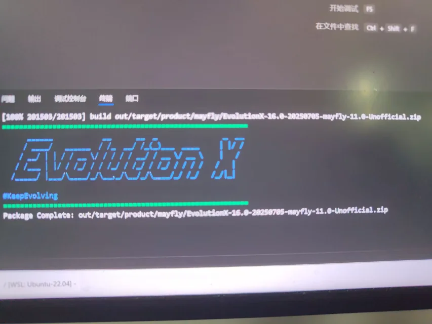

##  技术
***
### 2025.12.03

11月12日 Google:我们将Android16 qpr1源代码开源

12月2日 Lineageos:我们完成了Lineageos23.1对Android16 qpr1的适配

12月3日 Google:我们将Android16 qpr2源代码开源  
随后Lineageos:Google！！！F**k you
***
### 2025.05.02  
也是给手机刷上windows了(第一次看见手机刷windows还是在初中,直想尝试，但当时手上没有适配了uefi的设备)  
<video controls width="600">
  <source src="1.mp4" type="video/mp4">
</video>

***
### 2025.07.05
成功为我的小米12s编译出来了类原生系统(一直有这个想法，但以前电脑配置不够，没办法弄)

***
## 生活
***
### 2025.12.06  
牢了青几个小时,终于打过了
***
### 2025.12.05
打燕云的boss青，打的有点红温了
***
### 2025.12.02
拔个河能把我的腰扭伤，脆皮大学生竟是我自己
***
### 2024.06.12
趁国补入手新电脑，6700买了机械革命蛟龙16pro,r9-8945hx + 5070,32+1tb